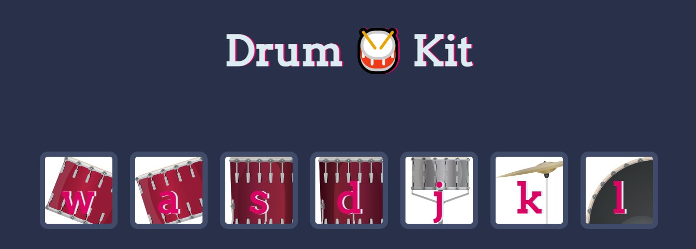

<!-- PROJECT -->

<a id="readme-top"></a>

<div align="center">
  

  <h3 align="center">Drum Kit</h3>

  <p align="center">
    A simple drum kit to practise JavaScript!
  </p>
</div>

<!-- TABLE OF CONTENTS -->
<details>
  <summary>Table of Contents</summary>
  <ol>
    <li>
      <a href="#about-the-project">About The Project</a>
      <ul>
        <li><a href="#built-with">Built With</a></li>
        <li><a href="#key-feature">Key Feature</a></li>
      </ul>
    </li>
    <li>
      <a href="#getting-started">Getting Started</a>
    </li>
    <li><a href="#contact">Contacts</a></li>
  </ol>
</details>

<!-- ABOUT THE PROJECT -->

## About The Project

In Drum Kit you can play different drum sounds using your keyboard. Each key corresponds to a specific drum, letting you create your own beats and rhythms. Unleash your inner drummer!

### Built With

<div display="flex">
  
	
	
 	
     	
</div>

### Key Feature

The `index.js` file is responsible for handling the interactivity of the Drum Kit web application. It uses jQuery to listen for user interactions (clicks and keyboard presses) and triggers corresponding sound effects and animations.

#### Variables

- `drumKeys`: A jQuery object representing all elements with the class "drum". These elements are the drum keys on the drum kit.

#### Functions

- `playSound(key)`: This function plays the corresponding sound for the given key. It uses a switch statement to determine the sound file based on the key pressed. The sound files are stored in the "sounds" directory.

- `buttonAnimation(key)`: This function triggers an animation for the button associated with the given key. It fades out the button quickly and then fades it back in, creating a visual feedback effect.

#### Event Listeners

- `$(drumKeys).click(function () {...})`: This event listener is triggered when a drum key is clicked. It retrieves the HTML content of the clicked key, plays the corresponding sound, and triggers the button animation.

- `$(document).keydown(function (event) {...})`: This event listener is triggered when a key is pressed on the keyboard. It retrieves the key pressed, plays the corresponding sound, and triggers the button animation.

<p align="right">(<a href="#readme-top">back to top</a>)</p>

<!-- GETTING STARTED -->

## Getting Started

To get a local copy up and running follow these simple example steps.

1. Clone the repo
   ```sh
   git clone https://github.com/majinbrum/drum-kit.git
   ```
2. Change git remote url to avoid accidental pushes to base project
   ```sh
   git remote set-url origin github_username/repo_name
   git remote -v # confirm the changes
   ```
3. Open the `index.html` file and play the demo! You just need to click on the buttons or press the recommended keys in your keyboard to play :)

<p align="right">(<a href="#readme-top">back to top</a>)</p>

<!-- CONTACTS -->

## Contacts

Bruna Alamia - [@linkedin](https://linkedin.com/in/brunaalamia) - brunaalamia@gmail.com

<p align="right">(<a href="#readme-top">back to top</a>)</p>
